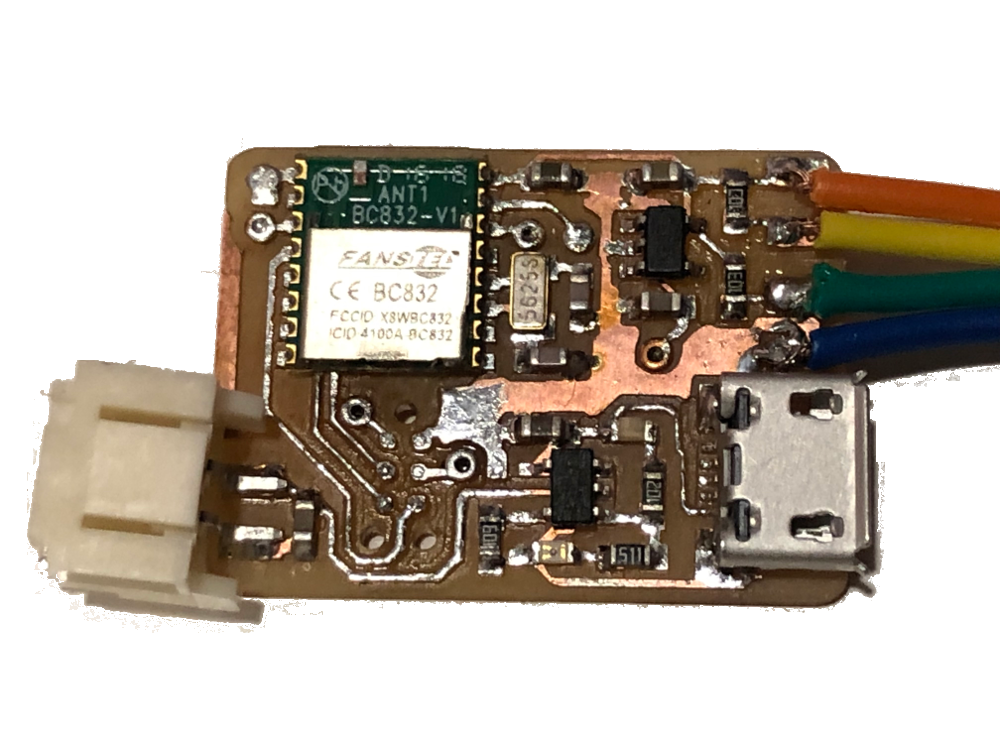
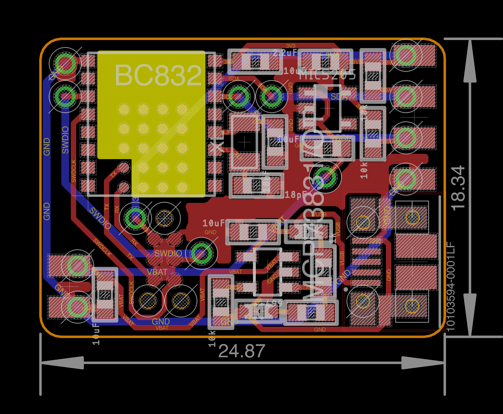
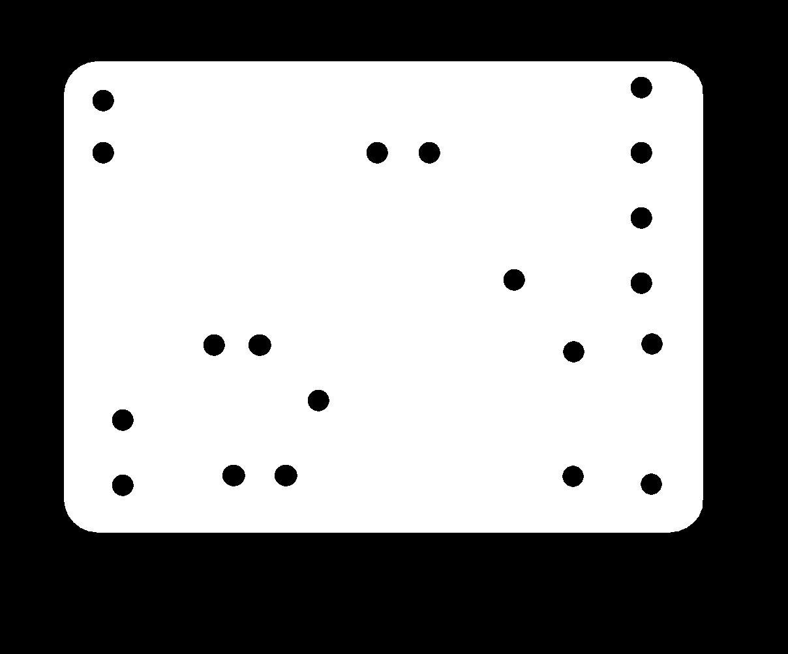
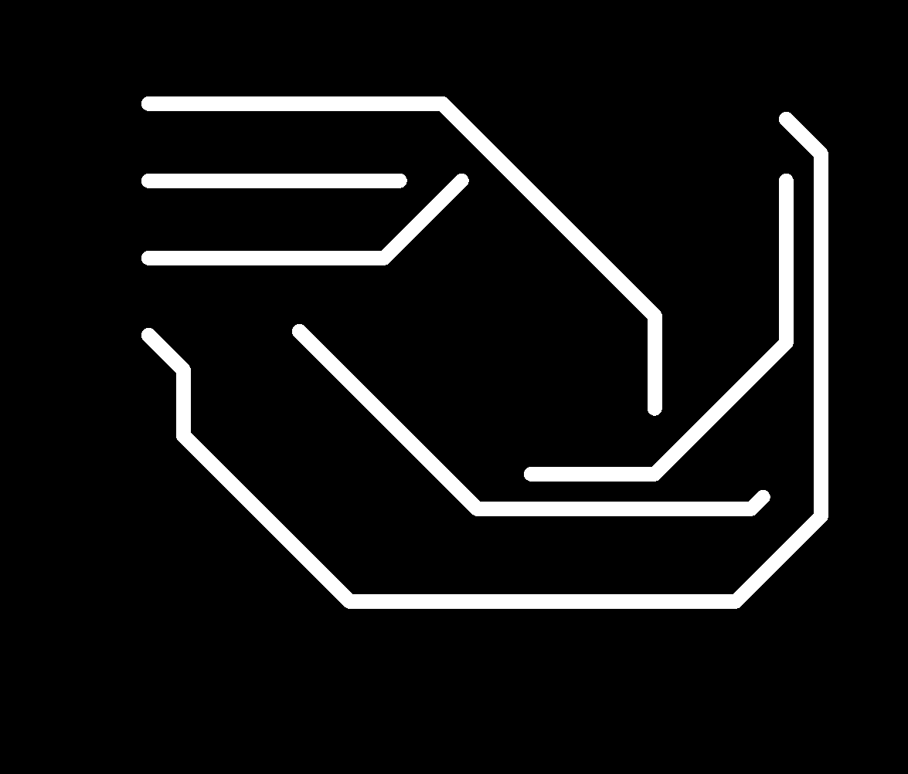

# Vegatooth I2C

    Using the BC832 to make a BLE-enabled I2C PCB

## Introduction

I like making tiny circuits. Last year I was taught about this [chip](https://www.fanstel.com/bt832-1/) based on the [NFC52832](http://infocenter.nordicsemi.com/pdf/nRF52832_PS_v1.1.pdf). It's essentially a Cortex-M4F process with integrated Bluetooth Low Energy (BLE) that measures 7.8x8.8mm. It has a lot of pins, hardware peripherals, processing power, it's tiny tiny, it's awesome. I started to play with it when I took HTMaA [last year](http://fab.cba.mit.edu/classes/863.17/CBA/people/tomasero/index.html), and failed miserably. Little by little, I've managed to establish a positive relationship with this chip, and this page is a compilation of my recipe to interact with this powerful tiny chip.

## Hardware

### Design

#### Components

Function                   | Name     | URL
-------------------------- | -------- | -------
MCU + BLE                  | BC832    | [1914-1017-1-ND](https://www.digikey.com/product-detail/en/fanstel-corp/BC832/1914-1017-1-ND/8323670)
3.3V Regulator             | MIC5205  | [576-1259-1-ND](https://www.digikey.com/product-detail/en/microchip-technology/MIC5205-3.3YM5-TR/576-1259-1-ND/771886)
Li-Ion/Poly Bat Charger    | MCP73831 | [MCP73831T-2ACI/OTCT-ND](https://www.digikey.com/product-detail/en/microchip-technology/MCP73831T-2ACI-OT/MCP73831T-2ACI-OTCT-ND/1979802)
Crystal 32.7680kHz 12.5 pF | Crystal  | [XC1617CT-ND](https://www.digikey.com/product-detail/en/ecs-inc/ECS-.327-12.5-34B-TR/XC1617CT-ND/1693786)
6-pin Tag Connect          | TC2030-IDC-NL | [TC2030-IDC-NL](http://www.tag-connect.com/TC2030-IDC-NL)

#### Circuit Schematic

#### Board Layout

### Fabrication

#### Milling

##### Mods Configuration

Step | File | Tool diameter (in) | Cut depth (in) | Max depth (in) | Offset number | Speed | Path order | Origin
---- | ---- | ------------------ | -------------- | -------------- | ------------- | ----- | ---------- | ------
Top rough | top | 0.0156 | 0.004 | 0.004 | 4 | 4 | forward | x, y
Top finish | top | 0.01 | 0.004 | 0.004 | 1 | 1 | forward | x, y
Top rubout | rub | 0.0312 | 0.004 | 0.004 | 12 | 4 | forward | x, y
Dim, holes, & vias | dim | 0.0312 | 0.024 | 0.072 | 1 | 1 | reverse | x, y
Frame | frame | 0.0312 | 0.024 | 0.072 | 1 | 4 | forward | x, y
Bottom | bottom | 0.0156 | 0.004 | 0.004 | 4 | 4 | forward | x-0.0312, y-0.0312

##### Top 

For the finish pass, a 0.01" endmill is used. This is a very thin tool, so using a mask file instead of the entire top file is preferable. Reducing the amount of work performed by the endmill reduces the probability of it breaking. Also, because a very slow speed is used for this pass, if the entire top file is used then it will take ages... so using a simpler mask file saves a significant amount of milling time.

##### Rubout

This is a fundamental steo to prevent the ball grid array pins from shorting each other!

##### Dimensions, holes, & vias

Invert the path order for the machine to mill the vias and holes first, and finish with the contour. I like to do this because I am scared that milling the contour first will allow for the board to move so the holes will be milled in the wrong locations. Another solution other than reversing the path order is separating the contour and holes/vias in different files and do the holes/vias first. 

##### Frame

I like to make the borders of my boards rounded. The problem is that if I flip the board and align it to a corner of the residual frame (e.g., bottom-left), the board won't be perfectly aligned. Therefore, after milling the top and holes/vias/dimensions of the board, the dimensions without rounded edges must be milled, creating a frame for the board to align against.

##### Bottom

Remember to flip the design horizontally. Before that, make sure to match the distance between the contour line and the edge of the file on both sides. In other words, make the distance between the right contour line of the board and the edge of the image be the same as the left distance. Moreover, decrease 0.0312", the width of the endmill, to the x and y origin. These steps are fundamental for the bottom layer to be milled correctly.

#### Soldering

To solder the BC832, put solder paste on the RX and TX BGA pins and on the castellated pins. Use either a hot air gun or a reflow oven. I use solder paste that melts at 215 degrees Celsius and heat the board for 45 seconds once it reaches 200 degrees Celsius. Beyond that temperature, FR1 (the material we use for milling boards at the Media Lab) will probably burn, blisters will pop up, and your board will be messed up.

## Software

Match the [tag-connect pins](http://www.tag-connect.com/Materials/TC2030-IDC-NL.pdf) with the tag-connect pads on your board. Connect the VCC, GND, IO, and CLK of the J-Link, and the RX and TX of the FTDI programmer. The VCC pin on the J-Link doesn't provide power, just senses that there is an appropriate power supply.

#### Bootloader

Follow this [tutorial](https://learn.adafruit.com/bluefruit-nrf52-feather-learning-guide?view=all) to learn how to install the (BSP (Board Support Package) on the Arduino IDE. You'll also have to install [nrfjprog](http://infocenter.nordicsemi.com/index.jsp?topic=%2Fcom.nordic.infocenter.tools%2Fdita%2Ftools%2Fnrf5x_command_line_tools%2Fnrf5x_installation.html) command line tools, and the [JLink Software](https://www.segger.com/downloads/jlink/). I use a J-Link to burn the bootloader, so use the second option described on that Adafruit torial: Updating the Bootloader with a Segger J-Link and Arduino IDE. If Arduino tells you that it can't find nrfjprog, you can change the access permissions of the folder where nrfjprog is installed, or just run the Arduino.app using sudo.

### Embedded

#### I2C Driver

##### Update Adafruit NRF52 Library

Update above 0.8.2 or I2C won’t work

##### Change I2C pins

    /Users/Tomasero/Library/Arduino15/packages/adafruit/hardware/nrf52/0.9.0/variants/feather_nrf52832

From:

    #define PIN_WIRE_SDA         (25u)
    #define PIN_WIRE_SCL         (26u)

To: 

    #define PIN_WIRE_SDA         (26u)
    #define PIN_WIRE_SCL         (27u)

#### Sketch

The embedded code to interface with the sensor used in this example, the [MPL3115A2](https://cdn.sparkfun.com/datasheets/Sensors/Pressure/MPL3115A2.pdf) can be found here: [MPL3115A2_BLE.ino](MPL3115A2_BLE/MPL3115A2_BLE.ino).

To send data via BLE, first import the required headers.

    #include <bluefruit.h>
    
    // BLE Service
    BLEDis  bledis;
    BLEUart bleuart;
    BLEBas  blebas;

Create a function to initialize the BLE. Here you can define a lot of parameters, including the transmission power, name of your device, and other configurations. Call that function in your setup method.

    void bleSetup() {
        Bluefruit.configPrphBandwidth(BANDWIDTH_MAX);
        Bluefruit.begin();
        Bluefruit.setTxPower(4);
        Bluefruit.setName("MPL3115A2");
        Bluefruit.setConnectCallback(connect_callback);
        Bluefruit.setDisconnectCallback(disconnect_callback);
        bledis.setManufacturer("MIT Media Lab");
        bledis.setModel("V2.0");
        bledis.begin();
      // Configure and Start BLE Uart Service
        bleuart.begin();
        Bluefruit.Advertising.addFlags(BLE_GAP_ADV_FLAGS_LE_ONLY_GENERAL_DISC_MODE);
        Bluefruit.Advertising.addTxPower();
        Bluefruit.Advertising.addService(bleuart);
        Bluefruit.ScanResponse.addName();
        Bluefruit.Advertising.restartOnDisconnect(true);
        Bluefruit.Advertising.setInterval(32, 244);   
        Bluefruit.Advertising.setFastTimeout(30);     
        Bluefruit.Advertising.start(0); 
    }

You need to setup the connect and disconnect callbacks, which can be found in the example sketch. Create a function that adds the values you want to send in an array and emits it. Remember ints and floats are 4 bytes long in the NRF52. In your 'loop' function, read from your sensors, process it as you wish, and then call the previously defined function to send the data via BLE.

    void sendData(){
      int numVals = 3;
      float vals[numVals];
      vals[0] = pascals;
      vals[1] = altm;
      vals[2] = tempC;
      int cnt = numVals * 4 ;
      uint8_t buf[cnt];
      for (int _i=0; _i<numVals; _i++)
        memcpy(&buf[_i*sizeof(float)], &vals[_i], sizeof(float));
      bleuart.write( buf, cnt );
    }

### Mobile

I created a barebones iOS app that connects to the BC832 and receives the data via BLE. The file where all of this is done is the [ViewController.swift](/MPL3115A2_App/MPL3115A2_App/ViewController.swift). 

First import CoreBluetooth

    import CoreBluetooth

Declare the necessary supporting managers

    var manager:CBCentralManager!
    var _peripheral:CBPeripheral!
    var sendCharacteristic: CBCharacteristic!
    var loadedService: Bool = true

Define the name of your device, which is the same as the one you used in the sketch, and the service, write, and read UUIDs. For the NRF52, the following ones are set by default.
    
    let NAME = "MPL3115A2"
    let UUID_SERVICE = CBUUID(string: "6E400001-B5A3-F393-E0A9-E50E24DCCA9E")
    let UUID_WRITE = CBUUID(string: "6E400002-B5A3-F393-E0A9-E50E24DCCA9E")
    let UUID_READ = CBUUID(string: "6E400003-B5A3-F393-E0A9-E50E24DCCA9E")

Use all the 'centralManager' and 'peripheral' functions that I wrote in the 'ViewController'. The important function is where the data is 'didUpdateValueFor'. I use the 'getBytes' method to extract the values you sent in your sketch, each 4 bytes long.

    func peripheral(_ peripheral: CBPeripheral, didUpdateValueFor characteristic: CBCharacteristic, error: Error?) {
      // Make sure it is the peripheral we want
    
      if characteristic.uuid == UUID_READ {
        // Get bytes into string
        let dataReceived = characteristic.value! as NSData
        print(dataReceived)
        
        var pressure: Float = 0
        var altitude: Float = 0
        var temperature: Float = 0
        
        dataReceived.getBytes(&pressure, range: NSRange(location: 0, length: 4))
        dataReceived.getBytes(&altitude, range: NSRange(location: 4, length: 4))
        dataReceived.getBytes(&temperature, range: NSRange(location: 8, length: 4))
    
        print(pressure, altitude, temperature);
        presValue.text = String(format: "%.1f inches (Hg)", pressure);
        altValue.text = String(format: "%.1f meters", altitude);
        tempValue.text = String(format: "%.1f *C", temperature);
      }
    }

# Happy making!
